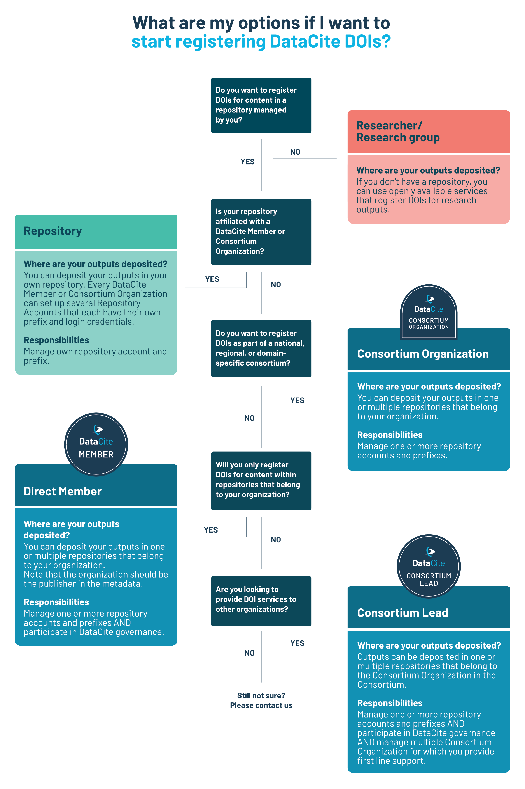
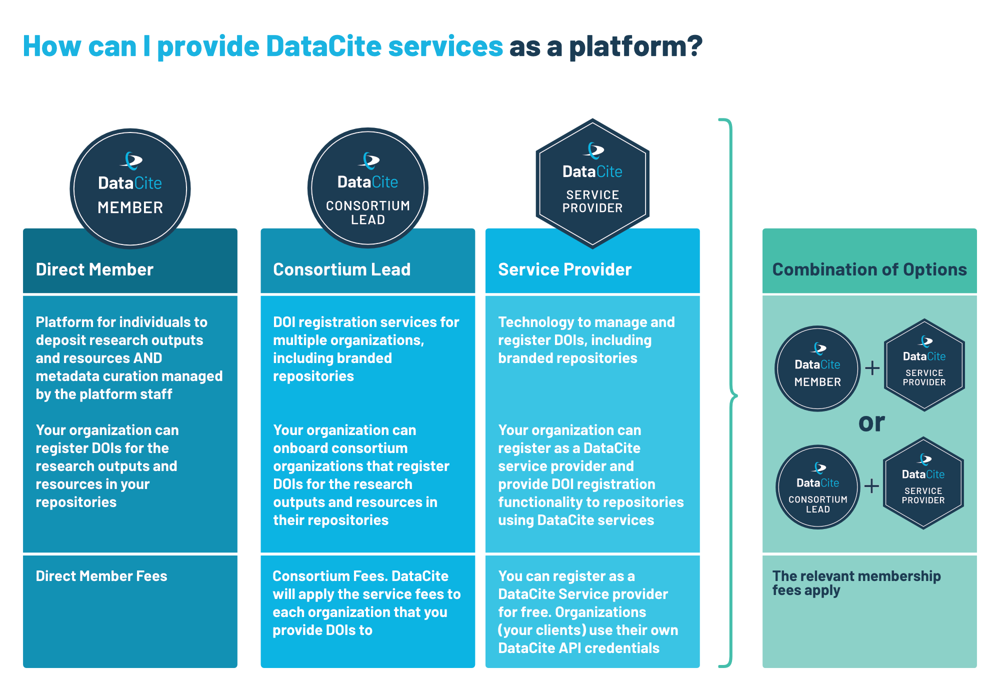

# Why join DataCite ?

DataCite is a global community of organizations and researchers identifying and citing research outputs and resources. We provide services to create persistent records of research, enable discovery and reuse, and support workflows throughout the research lifecycle.

We invite members from all types of organizations – including academic institutions, research organizations, government agencies, publishers, libraries, and funders – to join our global network committed to connecting research through partnership, advocacy, and by developing tools and services that accelerate sharing, use, and reuse of research outputs. Together, we are at the forefront of helping to transform scholarship by including all research output to serve society.

[DataCite Member organizations](/members.html) show their support in the following manner:

- They demonstrate an elevated level of commitment to open research.
- They become part of a global community, learning, collaborating, and advocating with a leading-edge network of research experts.
- They support and participate in the creation and management of persistent identifiers (DOIs) for research outputs.
- They play a critical role in advancing DataCite’s mission through their financial support.
- They help to shape DataCite’s future by serving on our [Executive Board](/governance.html) or [steering groups](/steering.html).

# Types of Membership

## 1) Member-only

This type of member supports DataCite’s research sharing mission and wants to collaborate with DataCite and/or be part of DataCite’s governance. These Members do not register DOIs.

## 2) Direct Member

This type of member supports DataCite's research sharing mission and is an organization that works with one or more repositories within their organization. The repositories are under the same administrative structure as the organization.

<h5 class="panel-title">
<a role="button" data-toggle="collapse" data-parent="#direct-member-accordion" href="#direct-member-description" aria-expanded="true" aria-controls="direct-member-description">Text version</a>
</h4>

 
This diagram shows the structure of a DataCite Direct Member and its repositories. The top icon in the hierarchy shows the “Member Organization,” from which three lines lead down to separate repositories. This diagram illustrates that a Direct Member can have one or more repositories.
 

 

 

 

## 3) Consortium

A consortium is a group of like-minded organizations that have come together to collectively participate in DataCite’s community and governance activities and use DataCite’s DOI services. Consortia are generally located in a single country or subject-based. Organizations within a consortium can work with one or more repositories.

Consortium guidelines

* A consortium is composed of five or more organizations that are under different administrative structures.

* Consortia should consist of a minimum of five organizations, including the consortium lead. New consortia are expected to reach this number in one year.

* All future Consortium Organizations should either be within one geographic region OR subject area.

* One organization within the consortium is designated the Consortium Lead and fulfills a range of responsibilities.

* Consortium Leads can distribute costs across the Consortium Organizations as per their own policies and structures.

<h5 class="panel-title">
<a role="button" data-toggle="collapse" data-parent="#consortium-accordion" href="#consortium-description" aria-expanded="true" aria-controls="consortium-description">Text version</a>
</h4>

 
This diagram shows the structure of a DataCite Consortium, which consists of a Consortium Lead, Consortium Organizations, their repositories. It illustrates that a Consortium has one Consortium Lead and several Consortium Organizations, each of which can have one or more repositories. The Consortium Lead can also be a Consortium Organization.

The top icon in the hierarchy shows the “Consortium Lead,” from which three lines lead down to separate “Organizations”: “Organization 1 (Also Consortium Lead Role)” on the left, “Organization 2” in the middle and “Organization 3” on the right. 

From  “Organization 1 (Also Consortium Lead Role)” two lines lead down to two separate repositories being on the third level of the diagram. Respectively “Organization 2” has a line that leads to one repository and “Organization 3” has two lines leading to two separate repositories. 

 

 

 

 

# Registering DataCite DOIs

<h5 class="panel-title">
<a role="button" data-toggle="collapse" data-parent="#organizations-accordion" href="#organizations-description" aria-expanded="true" aria-controls="organizations-description">Text version</a>
</h4>

 
Title: “What are my options if I want to start registering DataCite DOIs?”
 
Top of the decision tree infographic begins Q: “Do you want to register DOIs for content in a repository managed by you?“

<ol style="padding-right:10px">
<li>If “No”, then “Researcher/Research group – Where are your outputs deposited? If you don't have a repository, you can use openly available services that register DOIs for research outputs.”</li>
<li>If “Yes”, then Q: “Is your repository affiliated with a DataCite Member or Consortium  Organization?”</li>
<ol style="padding-right:10px">
<li>If “Yes”, then “Repository – Where are your outputs deposited? You can deposit your outputs in your own repository. Every DataCite Member or Consortium Organization can set up several Repository Accounts that each have their own prefix and login credentials. Responsibilities: Manage own repository account and prefix.”</li>
<li>If “No”, then Q: “Do you want to register DOIs as part of a national, regional, or domain-specific consortium?”</li>
<ol style="padding-right:10px">
<li>If “Yes”, then “Consortium Organization – Where are your outputs deposited? You can deposit your outputs in one or multiple repositories that belong to your organization. Responsibilities: Manage one or more repository accounts and prefixes.”</li>
<li>If “No”, then Q: “Will you only register DOIs for content within repositories that belong to your organization?”</li>
<ol style="padding-right:10px">
<li>If “Yes”, then “Direct Member – Where are your outputs deposited? You can deposit your outputs in one or multiple repositories that belong to your organization. Note that the organization should be the publisher in the metadata. Responsibilities: Manage one or more repository accounts and prefixes AND participate in DataCite governance.”</li>
<li>If “No”, then Q: “Are you looking to provide DOI services to other organizations?”</li>
<ol style="padding-right:10px">
<li>If “Yes”, then “Consortium Lead – Where are your outputs deposited? Outputs can be deposited in one or multiple repositories that belong to the Consortium Organization in the Consortium. Responsibilities: Manage one or more repository accounts and prefixes AND participate in DataCite governance AND manage multiple Consortium Organization for which you provide first line support.”</li>
<li>If “No”, then “Still not sure? Please contact us”</li>
</ol>
</ol>
</ol>
</ol>
</ol>

# Information for platforms

Within the DataCite community, there are a number of organizations, e.g. technology providers, that provide platforms for deposition of research outputs. Preferably, this is done as part of our Registered Service Providers Program.

Please note that when an organization:

* Provides DOIs to other, external organizations.
* Allows organizations to manage their own instance of a (institutional) repository.
* Allows content to be deposited to a branded platform.
* Enables metadata curation by an external organization which is considered the publisher.

this organization should join as a Consortium. Direct Members and Consortium Organizations cannot provide DOI services to external organizations.

<h5 class="panel-title">
<a role="button" data-toggle="collapse" data-parent="#platform-accordion" href="#platform-description" aria-expanded="true" aria-controls="platform-description">Text version</a>
</h4>

 

 
<table class="table pricing">
<thead>
<tbody>
<tr>
<th>Direct Member</th>
<th>Consortium Lead</th>
<th>Service Provider</th>
<th>Combination of Options</th>
</tr>
</thead>
<tr>
<td>Platform for individuals to deposit research outputs and resources AND metadata curation managed by the platform staff
Your organization can register DOIs for the research outputs and resources in your repositories</td>
<td>DOI registration services for multiple organizations, including branded repositories
Your organization can onboard consortium organizations that register DOIs for the research outputs and resources in their repositories
</td>
<td>Technology to manage and register DOIs, including branded repositories
Your organization can register as a DataCite service provider and provide DOI registration functionality to repositories using DataCite services</td>
<td>DataCite Direct Member + Service provider
Or
DataCite Consortium Lead + Service Provider
</td>
</tr>
<tr>
<td>Direct Member Fees</td>
<td>Consortium Fees. DataCite will apply the service fees to each organization that you provide DOIs to</td>
<td>You can register as a DataCite Service provider for free. Organizations (your clients) use their own DataCite API credentials</td>
<td>The relevant membership fees apply</td>
</tr>
</tbody>
</table>

 

 

 

 

# How to join DataCite ?

If you are interested in a DataCite membership please send an enquiry via the [enquiry form](/membership-enquiry.html) and we will get in touch with you.

# More information

* [DataCite Statutes](/documents/statutes.html)

* [Fee Model](/feemodel.html)

* [Membership FAQ](https://support.datacite.org/docs/general)
