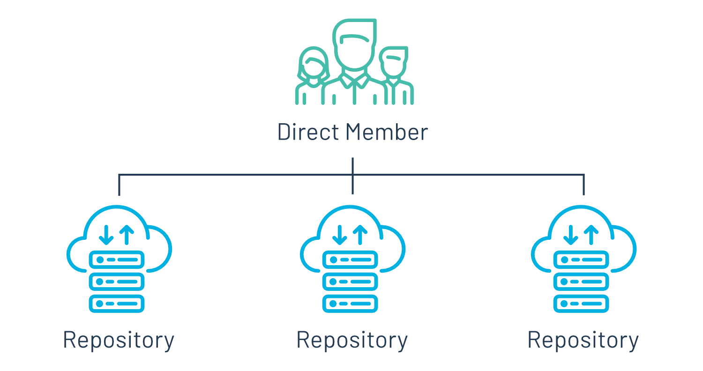
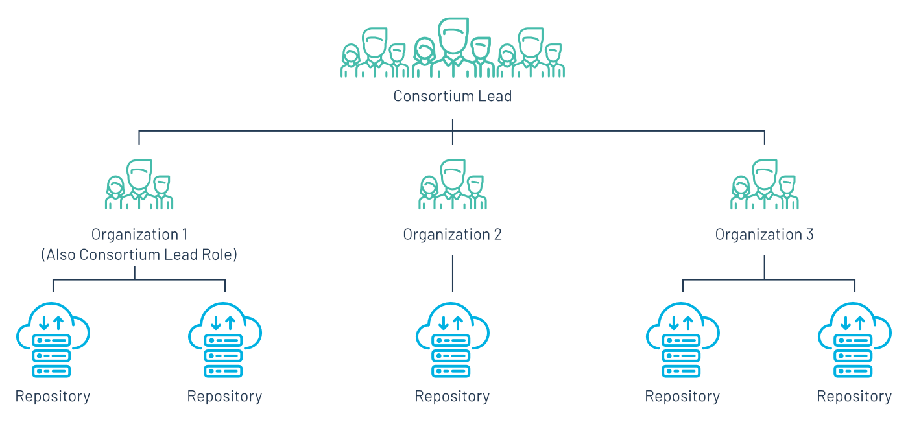
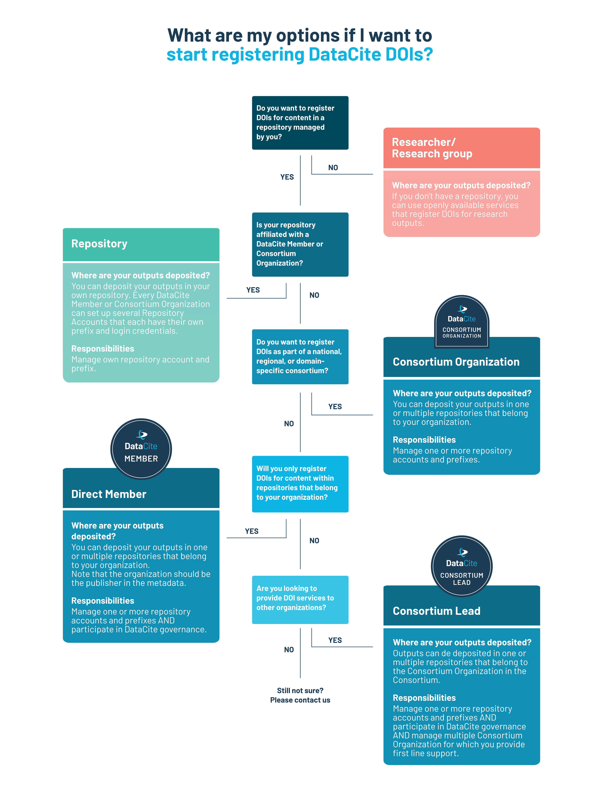
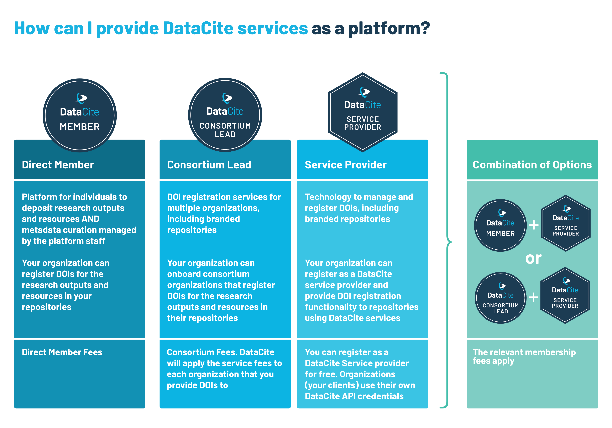

# Why join DataCite ?

DataCite is a global community of organizations and researchers identifying and citing research outputs and resources. We provide services to create persistent records of research, enable discovery and reuse, and support workflows throughout the research lifecycle.

We invite members from all types of organizations – including academic institutions, research organizations, government agencies, publishers, libraries, and funders – to join our global network committed to connecting research through partnership, advocacy, and by developing tools and services that accelerate sharing, use, and reuse of research outputs. Together, we are at the forefront of helping to transform scholarship by including all research output to serve society.

[DataCite Member organizations](/members.html) show their support in the following manner:

- They demonstrate an elevated level of commitment to open research.
- They become part of a global community, learning, collaborating, and advocating with a leading-edge network of research experts.
- They support and participate in the creation and management of persistent identifiers (DOIs) for research outputs.
- They play a critical role in advancing DataCite’s mission through their financial support.
- They help to shape DataCite’s future by serving on our [Executive Board](/governance.html) or [steering groups](/steering.html).

# Types of Membership

## 1) Member-only

This type of member supports DataCite’s research sharing mission and wants to collaborate with DataCite and/or be part of DataCite’s governance. These Members do not register DOIs.

## 2) Direct Member

This type of member supports DataCite's research sharing mission and is an organization that works with one or more repositories within their organization. The repositories are under the same administrative structure as the organization.

  

## 3) Consortium

A consortium is a group of like-minded organizations that have come together to collectively participate in DataCite’s community and governance activities and use DataCite’s DOI services. Consortia are generally located in a single country or subject-based. Organizations within a consortium can work with one or more repositories.

Consortium guidelines

* A consortium is composed of five or more organizations that are under different administrative structures.

* Consortia should consist of a minimum of five organizations, including the consortium lead. New consortia are expected to reach this number in one year.

* All future Consortium Organizations should either be within one geographic region OR subject area.

* One organization within the consortium is designated the Consortium Lead and fulfills a range of responsibilities.

* Consortium Leads can distribute costs across the Consortium Organizations as per their own policies and structures.

  

# Registering DataCite DOIs

  

# Information for platforms

  

Within the DataCite community, there are a number of organizations, e.g. technology providers, that provide platforms for deposition of research outputs. Preferably, this is done as part of our Registered Service Providers Program.

Please note that when an organization:

* Provides DOIs to other, external organizations.
* Allows organizations to manage their own instance of a (institutional) repository.
* Allows content to be deposited to a branded platform.
* Enables metadata curation by an external organization which is considered the publisher.

this organization should join as a Consortium. Direct Members and Consortium Organizations cannot provide DOI services to external organizations.

# How to join DataCite ?

If you are interested in a DataCite membership please send an enquiry via the [enquiry form](/membership-enquiry.html) and we will get in touch with you.

# More information

* [DataCite Statutes](/documents/statutes.html)

* [Fee Model](/feemodel.html)

* [Membership FAQ](https://support.datacite.org/docs/general)
