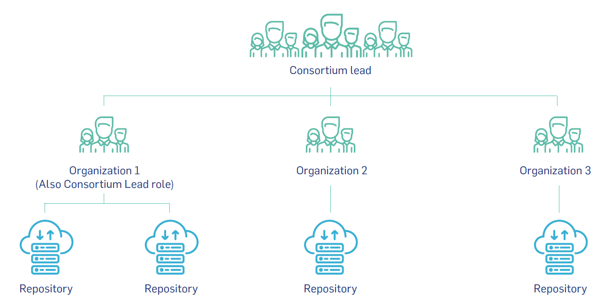

# Why join DataCite ?

Data are essential building blocks of scholarship and research. Being able to share data effectively is therefore extremely important. At DataCite, we develop and support tools and methods that make data more accessible and more useful.

We invite Members from all types of organizations – including academic institutions, research organizations, government agencies, publishers, libraries, and funders – to join our global network committed to supporting data sharing through partnership, advocacy, and by developing tools and services that accelerate data sharing, use, and reuse. Together, we will be at the forefront of helping to transform scholarship and the role of research data in our society.

As a [DataCite Member](/members.html), organizations show their support for research data sharing in the following manner:

- They demonstrate an elevated level of commitment to open data and open research.

- They become part of a global data-sharing community, learning, collaborating, and advocating with a leading-edge network of data research experts. 

- They support and participate in the creation and management of persistent identifiers (DOIs) for research outputs. 

- They play a critical role in advancing DataCite’s data-sharing mission through their financial support. 

- They help to shape the future DataCite – and data research in general – by serving on our Executive Board or DataCite steering groups.

# Types of Membership

## 1) Member-only

This type of member supports DataCite’s data sharing mission and wants to collaborate with DataCite and/or be part of DataCite’s governance. These Members do not register DOIs.

## 2) Direct Member

This type of Member is a consumer of DOI services and consists of an organization that works with one or more repositories within their organization. The repositories are under the same administrative structure as the organization.

  

## 3) Consortium Member

A consortium is a group of like-minded organizations that have come together to collectively participate in DataCite’s community and governance activities and use DataCite’s DOI services. A consortium is composed of two or more non-profit organizations that are under different administrative structures. Consortia are generally located in a single country or subject-based. Organizations within a consortium can work with one or more repositories.

  

# Repositories

Repositories play a key role in the DataCite Member model. We define a repository as a service operated by research organizations, where research materials are stored, managed and made accessible. A repository is a single unit and DataCite links the repository to information in re3data, where additional repository metadata are available.

However, we realize that not all content is hosted in repositories and therefore DataCite also includes periodicals as a designation. The term periodicals include journals, proceedings, books, blogs, and working paper series.

The repository information provided will be used and displayed throughout DataCite services including search, data usage statistics, Member DOI statistics, and third-party indexing services.

# More information

* [Price list](/pricelist.html)

* [Membership FAQ](https://support.datacite.org/docs/general)

* [Member roles and responsibilities](/assets/MemberRolesResponsibilities.pdf)

# How to join DataCite ?

If you are interested in a DataCite membership please fill out the application form and the Member profile, and contact us at [support@datacite.org](mailto:support@datacite.org).

- [Application form](/assets/datacite_application.pdf) 

- [Member profile form](/assets/datacite_profile.pdf) 

- [DataCite Statutes](/documents/statutes.html)
