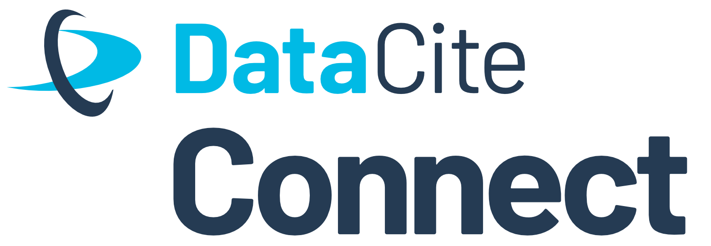

# DataCite Connect Gothenburg (#DataCiteConnect23)

  </img>

#### Date: March 20, 2022

#### Time: 13:00-16:30 CET

#### Location: Lindholmen Conference Centre, Room Tesla, Gothenburg, Sweden ([In colocation with the RDA Plenary](https://www.rd-alliance.org/plenary-meetings/next-plenary))

The DataCite CONNECT event in Gothenburg provides a forum for discussion and networking for DataCite members and the broader community. The session will focus on national PID and Open Science strategies and how the DataCite community can engage in, contribute to, and support their implementation. Participants will learn about on-going efforts across different regions and will have the chance to work together to identify and discuss alignments between national strategies and their current/future plans that leverage the DataCite infrastructure and services. The outcomes of the meeting will help DataCite members and community to better understand the PID landscape in other regions, connect with PID champions and establish new collaborations. There will be plenty of time for Q&A!

This is an in person event that will not be recorded or streamed. Slides of the speakers will be made available afterwards. Make sure to use the hashtag #DataCiteConnect23 when sharing your experience on socials.

## Agenda

* 13:00 Speed dating! (30 min)
* 13:30 DataCite Lightning Talk (15 min)
* 13:45 National PID and open science strategies (55 min)
    * Natasha Simons (ARDC, Australia)
    * Petra Černohlávková (NTK, Czechia)
    * Antonia Schrader (Helmholtz, Germany)
    * Gül Akcaova (SURF, Netherlands)
    * Chris Brown (JISC, UK)
    * Rebecca Ross (CRKN, Canada)
* 14:40 Break (10 min)
* 14:50 Follow up and Q&A (20 min)
* 15:10 Discussion in groups about national strategies (60 min)
* 16:10 Summary & Wrap up (30 min)
* 16:30 Time to connect

## Registration

*Please note that the maximum capacity of 60 people for this event and registrations will be allocated on a "first come first serve" basis. Save your spot now and be part of the conversation!*

[Register here](https://forms.gle/KzCMoyJbqN6hpktJ6) and please contact us at support(at)datacite.org if you have any issues/questions.

Registration for DataCite Connect is free of charge. We ask all participants to read and follow our [Code of Conduct](https://datacite.org/code-of-conduct.html).
