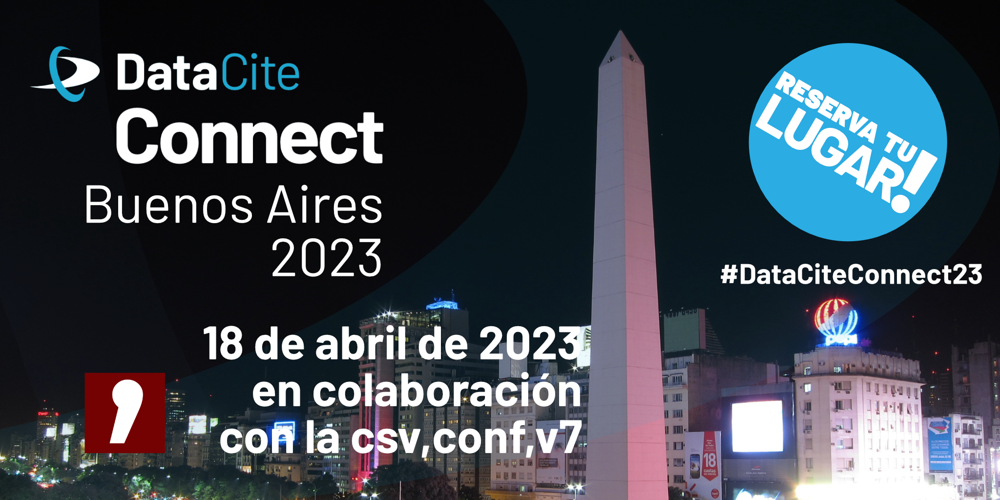

# DataCite Connect Buenos Aires (#DataCiteConnect23)

  </img>

#### Fecha: 18 de abril de 2023

#### Hora: 9-11 (hora local)

#### Lugar: Novotel Buenos Aires, Av. Corrientes 1334, C1043ABN CABA, Argentina (en colaboración con la [csv,conf,v7](https://csvconf.com/))

El evento DataCite Connect Buenos Aires ofrece un foro para la discusión y la creación de redes para los miembros de DataCite en América Latina. La sesión se centrará en discutir las perspectivas regionales en torno a la adopción de infraestructura de DataCite y cómo la comunidad puede participar, contribuir y apoyar su implementación. Los participantes tendrán la oportunidad de intercambiar historias de éxito y desafíos en torno a las comunicaciones, integraciones e ideas para la futura cooperación regional. Habrá mucho tiempo para establecer contactos y preguntas y respuestas.

Se trata de un evento presencial que no se grabará ni retransmitirá. Puedes utilizar el hashtag #DataCiteConnect23 para compartir tu experiencia en redes sociales.

 [Regístrate en este enlace](https://www.eventbrite.com/e/datacite-connect-buenos-aires-dataciteconnect23-tickets-556391831947) y contáctanos a través de support(at)datacite.org si tienes preguntas.

¡Nos vemos en Buenos Aires!

La inscripción para DataCite Connect es gratuita. Rogamos a todos los participantes que lean y respeten nuestro [Código de conducta (en inglés)](https://datacite.org/code-of-conduct.html).

 Si estás planeando asistir, regístrate también para el evento "Identificadores persistentes y ciencia abierta en América Latina", co-organizado junto a ORCID y ROR. Los detalles y la inscripción se encuentran en [esta página](https://datacite.org/pids-latam-2023.html).
