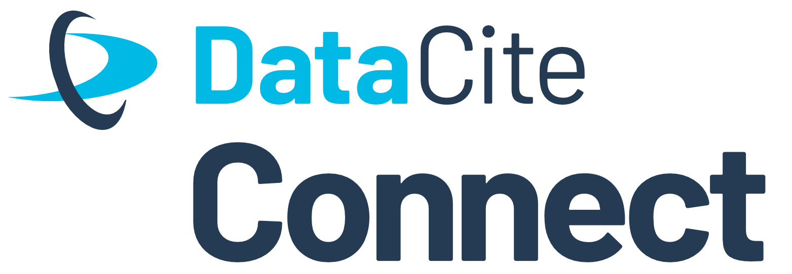

# DataCite Connect Buenos Aires (#DataCiteConnect23)

  </img>

#### Date: April 18, 2023

#### Time: 9-11 (local time)

#### Location: Novotel Buenos Aires, Buenos Aires, Argentina (in colocation with the [csv,conf,v7)](https://csvconf.com/)

The DataCite Connect event in Buenos Aires provides a forum for discussion and networking for DataCite members in Latin America. The session will focus on discussing regional perspectives around DataCite infrastructure adoption and how the DataCite community can engage in, contribute to, and support their implementation. Participants will have the chance to exchange success stories and challenges around communications, integrations and ideas for future regional cooperation. There will be plenty of time for networking and Q&A!

This is an in person event that will not be recorded or streamed. Make sure to use the hashtag #DataCiteConnect23 when sharing your experience on socials.

If you are planning to attend, please make sure you also register for “PIDs and open science in Latin America”, an event co-organized with ORCID and ROR. Details and registration on this page. 

## Agenda

* 09:00 Wellcome
* 09: 10 Lightning talk: DataCite in Latin America
* 09:25 Q&A
* 09:40 Ice-breaker
* 10:00 Group discussion
* 10:50 Goodbye