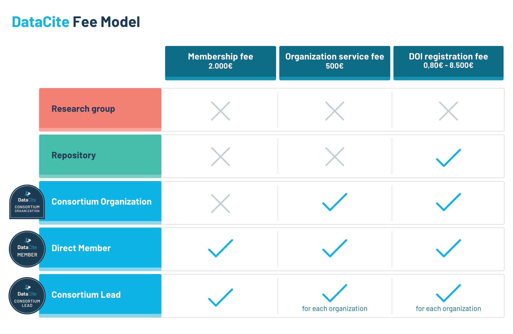

# Membership Fees

DataCite's strength is rooted in its active membership. Our global community of like-minded organizational members includes data centers, libraries, government agencies, research institutions and more. Members are the voting body of the organization and establish our vision and strategy, set our fee structure, and vote or stand for our Executive Board. Membership is open to all organizations that share our research sharing mission. Membership fees support DataCite’s goal to enable the discovery and reuse of research outputs in a global transition to Open Science.

***Annual Membership Fee: 2000€***

 
This fee applies to Member-only organizations, to Direct Members, and to a Consortium as a whole.

# DOI Service Fees

DataCite’s DOI Services are available to members for an additional service fee. Our robust infrastructure provides a simple and effective method of DOI creation and management; thereby enabling discovery, access, sharing, tracking, and citation. DataCite’s user-facing services: indexed content, help-desk, support site, and a metadata schema – support a range of diverse content types (data, text, images, software, workflows, and more).

Each Direct Member or Consortium Organization that makes use of DOI registration services will pay an annual service fee. This fee consists of an Organization fee and a tier based DOI registration fee:

## Organization Fee

#### Non-profit Organizations

The organization fee is 500€ per year. This fee includes all the repositories and prefixes needed by an organization to follow best practices.

#### For‐profit Organizations

In the case of for-profit organizations, a multiplier based on annual total revenue is applied to the organization fee (500€). For example, if the company’s annual revenue equals 20 million, the organization fee would be 5.000€ (500€ x 10).

<table class="table pricing">
<thead>
<tbody>
<tr>
<th>Revenue</th>
<th>Multiplier</th>
<th>Name</th>
</tr>
</thead>
<tr>
<td>0-500.000€</td>
<td>2</td>
<td>Micro</td>
</tr>
<tr>
<td>500.001€ - 2.000.000€</td>
<td>5</td>
<td>Small</td>
</tr>
<tr>
<td>2.000.001€ - 50.000.000€</td>
<td>10</td>
<td>Medium</td>
</tr>
<tr>
<td>50.000,001€ - 1.000.000.000€</td>
<td>15</td>
<td>Large</td>
</tr>
<tr>
<td>1.000.000.000€</td>
<td>20</td>
<td>Extra Large</td>
</tr>
</tbody>
</table>

## DOI Fee

There are several tiers for the number of new DOIs registered annually. The tiers accommodate different types of organizations and align with the cost impact. The DOI fee is based on the total number of DOIs registered in the previous calendar year across all repositories of an organization. In the first year the DOI fee is based on an estimate of DOIs the organization is planning to register from the start date until December 31st.

<table class="table pricing">
<thead>
<tr>
<th>Annual DOI range</th>
<th>Tier</th>
<th>DOI Fee</th>
</tr>
</thead>
<tbody>
<tr>
<td>0 - 1.999</td>
<td>Tier 1</td>
<td>0,80€ per DOI</td>
</tr>
<tr>
<td>2.000 - 10.000</td>
<td>Tier 2</td>
<td>1.600€</td>
</tr>
<tr>
<td>10.001 - 100.000</td>
<td>Tier 3</td>
<td>2.500€</td>
</tr>
<tr>
<td>100.001 - 250.000</td>
<td>Tier 4</td>
<td>3.500€</td>
</tr>
<tr>
<td>250.001 - 1.000.000</td>
<td>Tier 5</td>
<td>8.500€</td>
</tr>
</tbody>
</table>

For example, if the member registered 100 DOIs (across repositories) in the previous year, the total service fee will be as follows: 

- Organization fee: 500€
- DOI fee: 80€ (100x,80€)
- ***Total annual service fee: 580€***

## Consortium

A consortium is a group of organizations within one region or discipline that have come together to collectively participate in DataCite’s community and governance activities and use DataCite’s DOI services. A consortium is composed of five or more organizations that are under different administrative structures. Each consortium pays a single annual membership fee totaling 2.000€. Each consortium organization within the consortium pays the organization fee and the DOI fee. For-profit organizations can join a consortium as a Consortium Organization or they can lead a consortium when needed. In this case, the for-profit multiplier based on revenue is applied to the organization fee.  

Please note that consortium organizations that expect to register more than 10.000 DOIs annually should transfer to Direct Membership within the following calendar year, or pay the additional membership fee (2.000€ annually) while remaining part of the consortium. This ensures that there is appropriate cost recovery based on the impact of cost drivers.

#### Consortium fee caps

In order to support growing consortia and the adoption within communities, the total consortium service fee (organization + DOI fee) is capped based on the number of organizations. The total cap is calculated based on the total number of organizations within the consortium:

* 5-30 organizations: 1.000€ multiplied by total number of consortium organizations within the consortium
* 31-60 organizations: 700€ multiplied by total number of consortium organizations within the consortium
* 61-100 organizations: 600€ multiplied by total number of consortium organizations within the consortium
* 101+ organizations: 500€ multiplied by total number of consortium organizations within the consortium

Please note that when the fee cap applies, consortia will be invoiced for new consortium organizations in line with the fee cap and not based on individual estimates. The consortium fee caps do not apply to for-profit consortia and for-profit consortium organizations.

## Application of the fee structure

<h5 class="panel-title">
<a role="button" data-toggle="collapse" data-parent="#fee-model-accordion" href="#fee-model-description" aria-expanded="true" aria-controls="fee-model-description">Text version</a>
</h4>

 

  <table class="table pricing">
<thead>
<tbody>
<tr>
<th></th>
<th>Membership fee 2.000€</th>
<th>Organization service fee 500€</th>
<th>DOI registration fee 0,80€-8.500€</th>
</tr>
</thead>
<tr>
<td>Research Group</td>
<td>no</td>
<td>no</td>
<td>no</td>
</tr>
<tr>
<td>Repository</td>
<td>no</td>
<td>no</td>
<td>yes</td>
</tr>
<tr>
<td>Consortium Organization</td>
<td>no</td>
<td>yes</td>
<td>yes</td>
</tr>
<tr>
<td>Direct Member</td>
<td>yes</td>
<td>yes</td>
<td>yes</td>
</tr>
<tr>
<td>Consortium Lead</td>
<td>yes</td>
<td>yes, for each organization</td>
<td>yes, for each organization</td>
</tr>
</tbody>
</table>
 

 

 

 

 

## Payment Methods and Billing Cycle

DataCite invoices annually at the beginning of the calendar year. Direct Members and Consortium Organizations that join DataCite during the calendar year will be charged, in the month after they joined, pro-rated fees based on the month joined. The DOI fee will be billed based on their DOI estimate for the first year. There will be no credit if they register less nor an additional charge if they register more DOIs. There is no refund if a Consortium Organization leaves the Consortium during the year. For Consortia where the fee cap applies, the invoice will be based on the relevant fee cap.

Payments can be made either via bank wire transfer, check or credit card.

In case undisputed fee payments are late more than ninety (90) days, repository accounts will become temporarily inactive until the payments are made.

