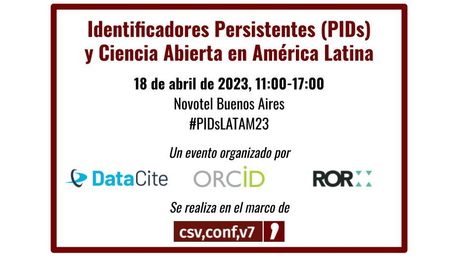

# Identificadores persistentes (PIDs) y ciencia abierta en Latinoamérica

  </img>

DataCite, ORCID y ROR tienen el agrado de invitar a la comunidad de investigación latinoamericana a participar de un evento enteramente dedicado a los identificadores persistentes y la ciencia abierta en la región. Dirigido a directores y gestores de investigación, bibliotecarios y personal técnico, en este encuentro hablaremos sobre los beneficios de los identificadores persistentes y cómo su adopción contribuye a la ciencia abierta y a un ecosistema de investigación más abierto y robusto. Se presentarán casos de uso de instituciones argentinas e internacionales y habrá amplio espacio para la discusión y el networking. La inscripción es gratuita pero las plazas son limitadas, así que recomendamos que se registren a la brevedad.

 [¡Regístrate ahora!](https://www.eventbrite.com/e/identificadores-persistentes-pids-y-la-ciencia-abierta-en-america-latina-tickets-547874145317)

No olviden usar el #PIDsLATAM23 para promover el evento en redes sociales.

¡Esperamos verlos en Buenos Aires!

El evento se realiza en el marco de la [csv,conf,v7](https://csvconf.com/)

#### Fecha y hora: 18 abril 2023 de 11:00 a 17:00 (hora local). Habrá refresco y almuerzo para los participantes.

#### Lugar: [Hotel Novotel](https://www.google.com/maps/place/Novotel+Buenos+Aires/@-34.6041022,-58.3857227,15z/data=!4m2!3m1!1s0x0:0x15f0a3bfba8ea603?sa=X&ved=2ahUKEwizib-h_5f9AhXDSPEDHQgRCroQ_BJ6BQiAARAH) Buenos Aires, Av. Corrientes 1334, C1043ABN CABA, Argentina.

## Programa preliminar

11:00 Registro (20) 

11:30 Bienvenida (10 min) 

#### Los PIDs y la ciencia abierta

- 11:40 Gustavo Durand (Dataverse, Estados Unidos)
- 12:00 Washington Segundo ( IBICT, Brasil) 
- 12:20 Abel del Carpio (CONCYTEC, Perú)
- 12:40 Discusión

13:00 Almuerzo

#### Los PIDs como infraestructura abierta de investigación

- 14:00 Ana Cardoso (ORCID, México)
- 14:10 Gabriela Mejias (DataCite, Alemania)
- 14:20 Maria Gould (ROR, Estados Unidos) 
- 14:30 Discusión

#### Implementación de PIDs en América Latina

- 14:50 Paola Carolina Bongiovani (UNR, Argentina) 
- 15:05 Rodrigo Donoso (Universidad de Chile, Chile) 
- 15:20 Paula Saavedra (Consortia, Colombia) 
- 15:35 Joel Torres y Nydia Lopez (eSCIRE, México) 

15:50 Discusión 

16:10 Próximos pasos para la colaboración en torno a los PIDs en Latinoamérica

16:50 Conclusiones y despedida (10 min)
