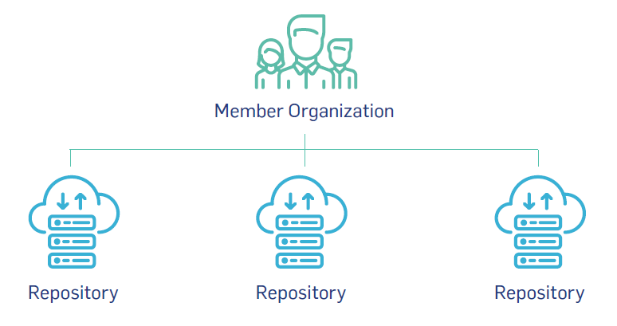
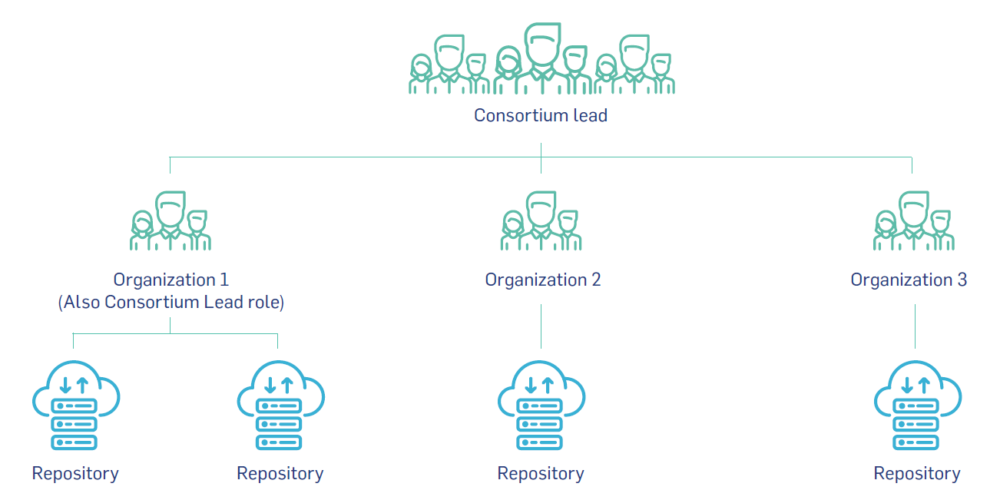

# Membership Fees

DataCite's strength is rooted in its active membership. Our global community of like-minded Members includes data centers, libraries, government agencies, research institutions and more. Members are the voting body of the organization and establish our vision and strategy, set our fee structure, and vote or stand for our Executive Board. Membership is open to all organizations that share our research sharing mission. Membership fees support DataCite’s goal of making all research outputs a critical component of the research landscape.

***Annual Membership Fee: 2000 euros***

# DOI Service Fees

DataCite’s DOI Services are available to Members for an additional service fee. Our robust infrastructure provides a simple and effective method of DOI creation and management thereby enabling discovery, access, sharing, tracking, and citation. DataCite’s user-facing services -- indexed content, help-desk, support site, and a metadata schema –support a range of diverse content types (data, text, images, software, workflows, and more).

## DOI Service Fees for Non‐profit Organizations

DOI Service Fees are based on the annual number of repositories and the total number of DOIs created annually. Organizations are charged a base rate of 500€ for 1 repository and 500€ for 10,000 DOIs.  Organizations are invoiced the following month for an increase in the number of repositories at a prorated rate.  For example, if a Direct Member or a Consortium Organization is currently registering DOIs for one repository and adds an additional repository, thus changing to the range 2-5 repositories, the organization will be charged a pro-rated fee starting at the 1st of the following month. Any overage in the number of DOIs will be billed the following year.

<table class="table pricing">
<thead>
<tr>
<th colspan="2">Repositories</th>
<th colspan="2">DOIs (Digital Object Identifiers)</th>
</tr>
<tr>
<th>Ranges</th>
<th>Annual Fee</th>
<th>Ranges</th>
<th>Annual Fee</th>
</tr>
</thead>
<tbody>
<tr>
<td>0‐1</td>
<td>500€</td>
<td>0‐10,000</td>
<td>500€</td>
</tr>
<tr>
<td>2‐5</td>
<td>1,000€</td>
<td>10,001‐100,000</td>
<td>2,000€</td>
</tr>
<tr>
<td>6‐10</td>
<td>3,000€</td>
<td>100,001 and up</td>
<td>3,000€</td>
</tr>
<tr>
<td>11‐50</td>
<td>6,000€</td>
<td></td>
<td></td>
</tr>
<tr>
<td>50 and up</td>
<td>10,000€</td>
<td></td>
<td></td>
</tr>
</tbody>
</table>

## DOI Service Fees: Direct Member and Consortium Member

There are two different ways non-profit organizations can use DataCite’s DOI services: 1) as a **Direct Member** or 2) as a **Consortium Member**.

## Direct Member

A Direct Member is an organization that works with one or more repositories within the same administrative structure as the Direct Member. Each Direct Member pays an annual membership fee of 2000€ and DOI service fees based on the annual number of repositories and DOIs.

  

<table class="table pricing">
<tr>
<th class="text-left" colspan="7">Example pricing: Direct Member with 3 repositories and 10,000 DOIs</th>
</tr>
<tr>
<td></td>
<td>Membership Fee</td>
<td>Number of Repositories</td>
<td>Repository Fee</td>
<td>Number of DOIs /year</td>
<td>DOI Fee</td>
<td>Total Membership Fee and Service Fee</td>
</tr>
<tr>
<td>Direct Member Organization</td>
<td> 2000€</td>
<td>3</td>
<td> 1000€</td>
<td>10,000</td>
<td>500€</td>
<td> 3500€</td>
</tr>
</table>

## Consortium Member

A consortium is a group of like-minded organizations that have come together to collectively participate in DataCite’s community and governance activities and use DataCite’s DOI services. A consortium is composed of two or more non-profit organizations that are under different administrative structures. Each consortium pays a single annual membership fee totaling 2000 euros – the membership fee is often split between organizations within the consortium. Each organization within the consortium pays DOI service fees.  DOI Services Fees are based on the number of repositories and DOIs within a single administrative unit within an organization. One organization within the consortium is designated the consortium lead and fulfills a range of responsibilities.

  

<table class="table pricing">
<tr>
<th colspan="7">Example pricing: four consortium organizations and a varied number of repositories and DOIs</th>
</tr>
<tr>
<td></td>
<td>Membership Fee (split between organizations)</td>
<td>Number of Repositories</td>
<td>Repository Fee</td>
<td>Number of DOIs /year</td>
<td>DOI Fee</td>
<td>Total Membership Fee and Service Fee</td>
</tr>
<tr>
<td>Organization 1 (consortium lead)</td>
<td> 666€</td>
<td>2</td>
<td> 1000€</td>
<td>8,500</td>
<td> 500€</td>
<td> 2166€</td>
</tr>
<tr>
<td>Organization 2</td>
<td>666€</td>
<td>1</td>
<td> 500€</td>
<td>600</td>
<td>500€</td>
<td>1666€</td>
</tr>
<tr>
<td>Organization 3</td>
<td>666€</td>
<td>1</td>
<td> 500€</td>
<td>1,500</td>
<td> 500€</td>
<td>1666€</td>
</tr>
<tr>
<td>Totals</td>
<td>2000€</td>
<td></td>
<td> 2000€</td>
<td></td>
<td>1500€</td>
<td> 5500€</td>
</tr>
</table>

## For‐profit Organizations

DOI Service Fees are based on the total annual revenue of the organization. The "Start‐up" category is for newly formed organizations and will be determined on a case-by-case basis.

<table class="table pricing">
<tr>
<th>Annual Revenue</th>
<th>Annual Fee</th>
</tr>
<tr>
<td>Start-up</td>
<td>1,500€</td>
</tr>
<tr>
<td>&lt; 1,000,000€</td>
<td>5,000€</td>
</tr>
<tr>
<td>&gt; 1,000,000€</td>
<td>15,000€</td>
</tr>
</table>

## Payment Methods and Billing Cycle

Payments can be made either via bank wire transfer, check or credit card.

DataCite invoices annually at the beginning of the year. Organizations that join DataCite during the calendar year will be charged pro-rated fees based on the month joined.

## Download Price List

The Price List 2019 can be downloaded [here](/assets/DataCitePriceList2019.pdf).
